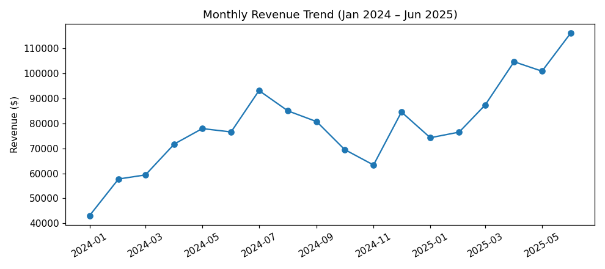
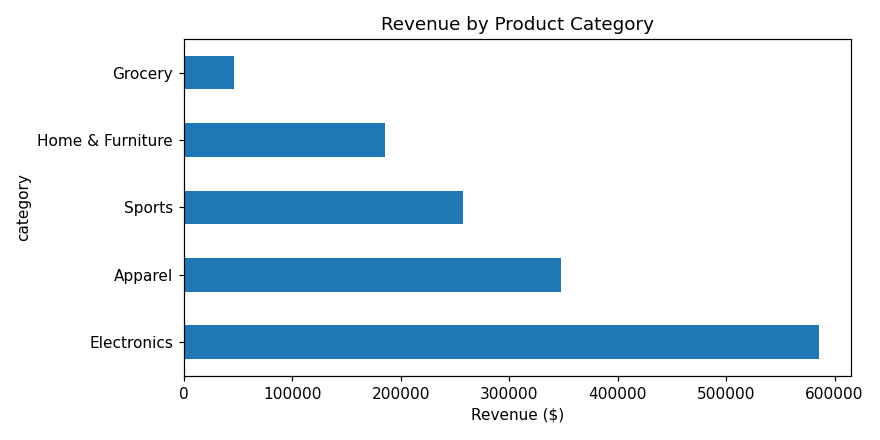
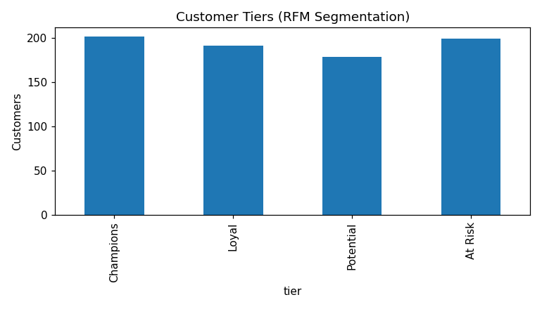
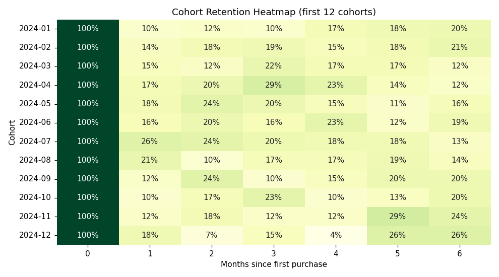
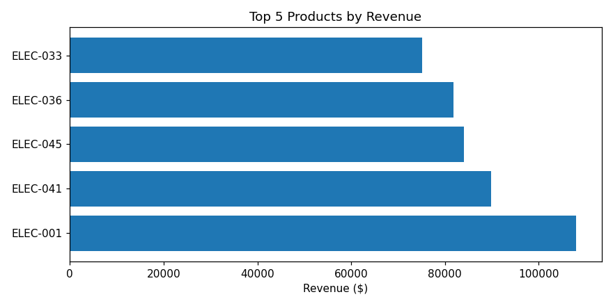

# Retail Sales & Customer Analysis

End-to-end exploratory data analysis of 18 months of retail transactions using **Python (Pandas, NumPy)** and **Matplotlib/Seaborn**.

## What's inside
- `notebooks/retail_sales_eda.ipynb` — the full analysis (rendered with outputs)
- `data/` — transactions, customers, products (synthetic, seeded for reproducibility)
- `images/` — all charts

## Analysis
1. **Revenue trend** — monthly revenue with month-over-month growth rates
2. **Category & product performance** — revenue mix and top-5 products
3. **RFM customer segmentation** — Champions / Loyal / Potential / At Risk tiers
4. **Cohort retention** — monthly cohorts tracked over subsequent months

## Key findings
- **$1,423,043** total revenue across **2,677 orders** (AOV **$532**)
- **Electronics** is the top category at **$585,962**
- **202 Champions** drive **47%** of all revenue
- Average month-1 retention: **16%** — biggest drop-off point for re-engagement
- Latest month-over-month growth: **+15.2%** (peak: Jun 2025)

## Charts






## Run it
```bash
pip install -r requirements.txt
jupyter notebook notebooks/retail_sales_eda.ipynb
```
